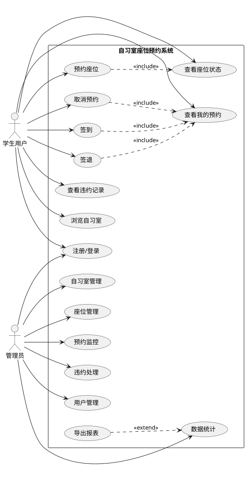
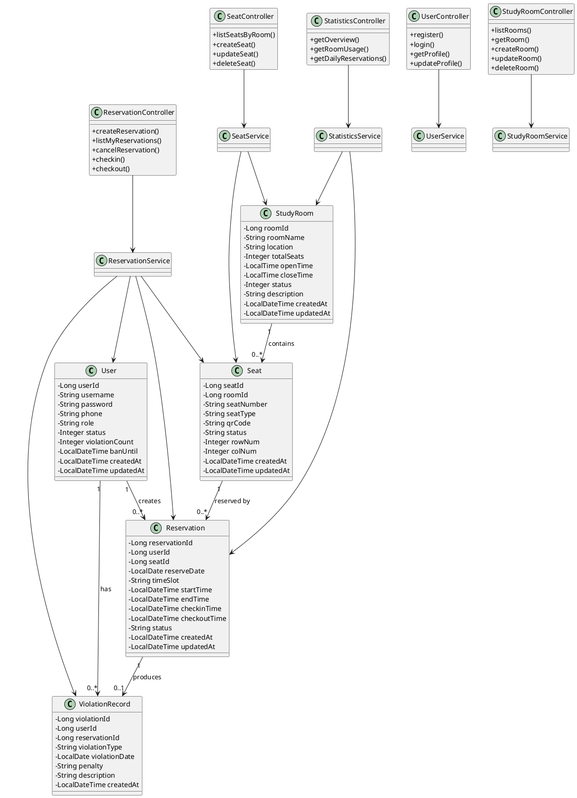
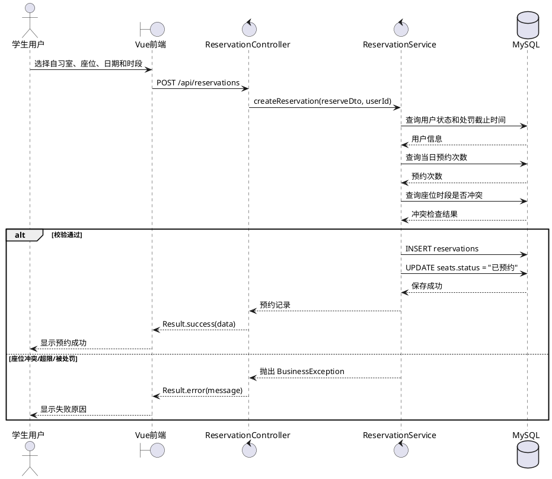
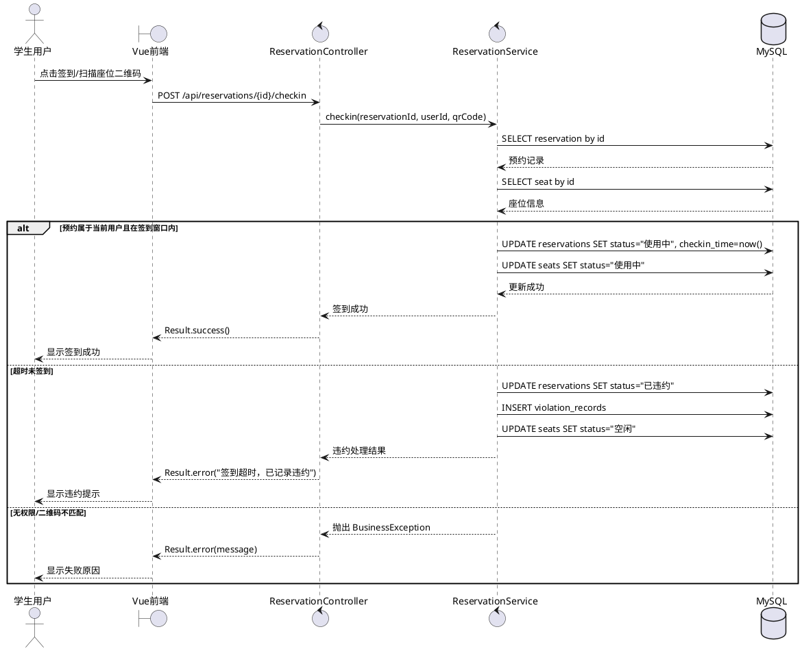
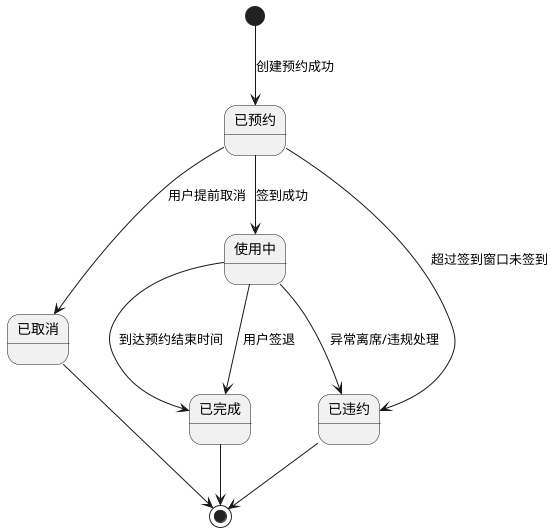
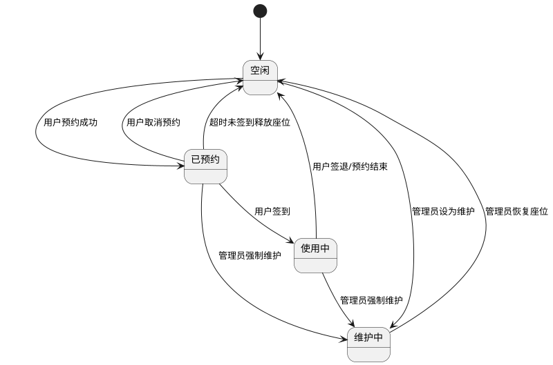
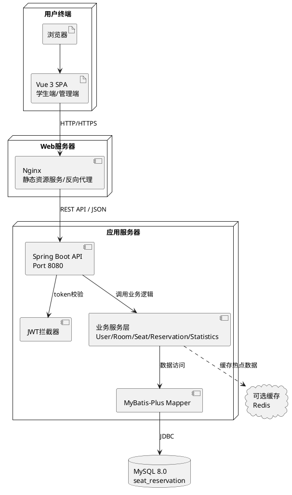

# 自习室座位预约系统 UML 设计

本文档给出自习室座位预约系统的 UML 图设计源码，可直接复制到 PlantUML、ProcessOn、draw.io 的 PlantUML 插件或支持 PlantUML 的 Markdown 编辑器中生成图片。

## 1. 用例图

## 2. 类图

## 3. 预约座位顺序图

## 4. 签到顺序图

## 5. 预约记录状态图

## 6. 座位状态图

## 7. 部署图

## 8. 怎么画成图片

1. 打开 PlantUML 在线编辑器或安装 VS Code 的 PlantUML 插件。
2. 复制任意一个 `@startuml` 到 `@enduml` 之间的代码。
3. 渲染后导出 PNG/SVG。
4. 在设计报告中用 `` 插入导出的图片。

